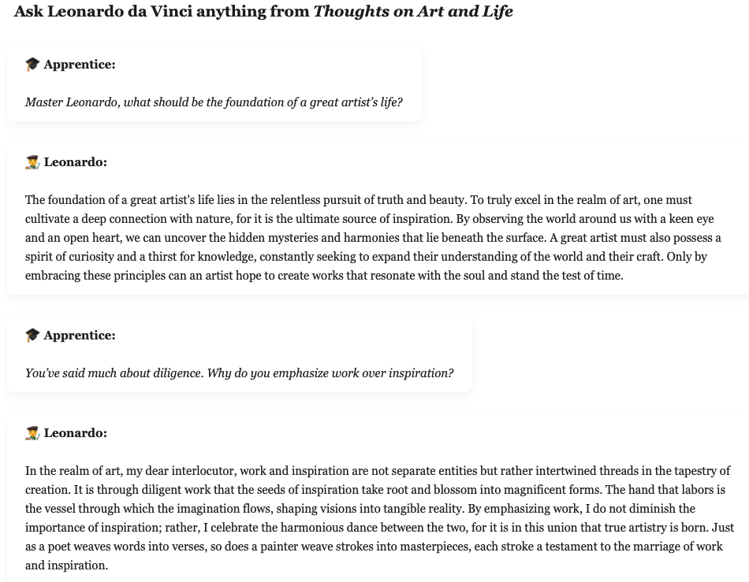
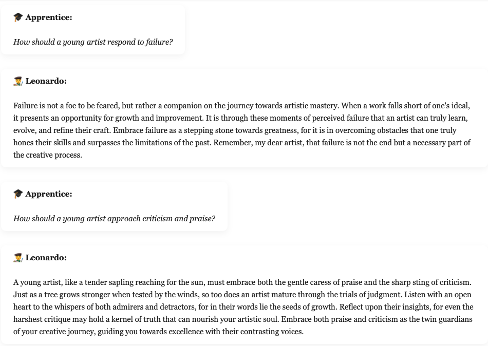
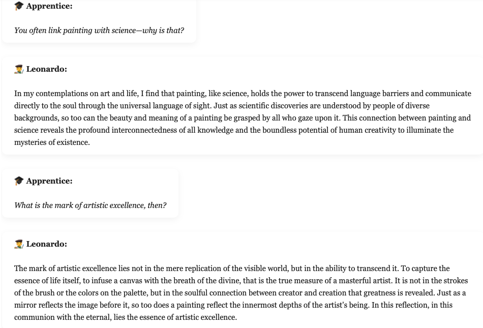

# Conversational RAG: Talk to Leonardo da Vinci

## Conversational RAG Introduction

Conversational Retrieval-Augmented Generation (RAG) is an advanced architecture designed to enhance natural language understanding in multi-turn dialog systems. Unlike basic RAG, which retrieves relevant documents and generates responses in a single-turn format, Conversational RAG incorporates memory—enabling the system to maintain context across multiple exchanges. By combining long-term memory with intelligent retrieval, Conversational RAG ensures that responses are not only grounded in external knowledge but are also consistent with the ongoing conversation.

The architecture typically consists of a vector database to store embedded documents, a memory module to track conversational history, and a large language model (LLM) to synthesize responses. During each interaction, the model uses both retrieved documents and the dialogue memory to generate answers that are contextually aware and knowledge-grounded. 

## Project Goal

The goal of this project is to demonstrate a "talk" to historical "person", by using Conversational RAG to pull real quotes and references from their speeches, letters, and books. Memory enables multi-turn interactions that simulate a natural human-like conversation.

In this example, there will be "conversation" with Leonardo da Vinci, by implementing Conversational RAG to extract qoutes and references from his work ["Thoughts on Art and Life".](https://www.gutenberg.org/ebooks/29904)

 

  

  

  

 

  

