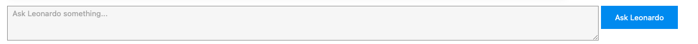

# Conversational RAG: Talk to Leonardo da Vinci

## Conversational RAG Introduction

Conversational Retrieval-Augmented Generation (RAG) is an advanced architecture designed to enhance natural language understanding in multi-turn dialog systems. Unlike basic RAG, which retrieves relevant documents and generates responses in a single-turn format, Conversational RAG incorporates memory—enabling the system to maintain context across multiple exchanges. This is particularly powerful for applications like virtual assistants, tutoring bots, or expert agents, where user queries often reference previous interactions. By combining long-term memory with intelligent retrieval, Conversational RAG ensures that responses are not only grounded in external knowledge but are also coherent with the ongoing conversation.

The architecture typically consists of a vector database to store embedded documents, a memory module to track conversational history, and a large language model (LLM) to synthesize responses. During each interaction, the model uses both retrieved documents and the dialogue memory to generate answers that are contextually aware and knowledge-grounded. Frameworks like LlamaIndex and LangChain provide ready-to-use components to build such systems, enabling construction of robust and intelligent agents that feel more human-like and contextually fluent.

## Project Goal

The goal of this project is to create a chatbot where users can "talk" to historical "figures", by using RAG to pull real quotes and references from their speeches, letters, and books. Memory enables multi-turn interactions that simulate a natural conversation.

In this example, there will be "conversation" with Leonardo da Vinci, by using Conversational RAG to extract qoutes and references from his work ["Thoughts on Art and Life".](https://www.gutenberg.org/ebooks/29904)

  

  

  

  

